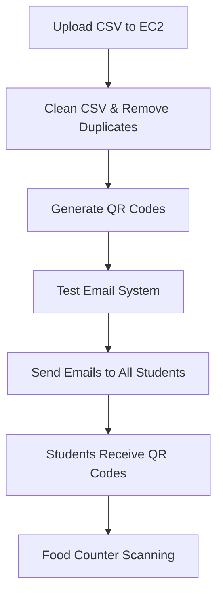

# 🚀 Complete AWS EC2 Docker Deployment Guide
## Option 1: Full Docker Deployment with Duplicate Removal

### **📋 Prerequisites**
- AWS EC2 instance (t3.micro or higher, Ubuntu 22.04)
- Your project files uploaded to EC2
- CSV file from Google Forms
- Email credentials ready

---

## **🎯 Step-by-Step Deployment Process**

### **Step 1: AWS EC2 Setup**
```bash
# 1. Launch EC2 instance (t3.micro, Ubuntu 22.04)
# 2. Configure Security Groups:
#    - SSH (22) from your IP
#    - HTTP (80) from anywhere  
#    - Custom TCP (3000) from anywhere

# 3. SSH into your instance
ssh -i your-key.pem ubuntu@your-ec2-public-ip
```

### **Step 2: Install Docker**
```bash
# Update system
sudo apt update && sudo apt upgrade -y

# Install Docker (one command)
curl -fsSL https://get.docker.com | bash

# Add user to docker group
sudo usermod -aG docker ubuntu

# Apply group changes
newgrp docker

# Verify installation
docker --version
docker-compose --version
```

### **Step 3: Upload Your Project**
```bash
# Option A: Using git (if you have a repository)
git clone https://github.com/yourusername/food-token-app-scanner.git
cd food-token-app-scanner

# Option B: Using SCP (upload from your local machine)
# From your local machine:
scp -i your-key.pem -r /path/to/food-token-app-scanner ubuntu@your-ec2-ip:~/
# Then SSH and cd into the directory
```

### **Step 4: Configure Environment**
```bash
# Create .env file with your email credentials
nano .env

# Add these contents:
EMAIL_HOST=smtp.gmail.com
EMAIL_PORT=587
EMAIL_USER=your-email@gmail.com
EMAIL_PASSWORD=your-app-password
EMAIL_FROM_NAME=College Food Token System
EMAIL_SUBJECT=Your Food Token QR Code

NODE_ENV=production
PORT=3000

# Save and exit (Ctrl+X, Y, Enter)
```

### **Step 5: Upload CSV Data**
```bash
# Upload your Google Forms CSV file
# Make sure it's named 'food_pref.csv' and has these columns:
# - Enter Your Name
# - Enter Your College Mail ID  
# - Enter Your USN
# - Class
# - What kind of food do you prefer

# You can upload via SCP:
# scp -i your-key.pem food_pref.csv ubuntu@your-ec2-ip:~/food-token-app-scanner/
```

### **Step 6: Deploy with Docker**
```bash
# Start the application
docker-compose up -d

# Check if container is running
docker-compose ps
```

### **Step 7: Complete Data Processing Pipeline**

#### **7.1: Clean CSV and Remove Duplicates**
```bash
# This removes duplicates, timestamps, and cleans data
docker-compose exec food-token-scanner python3 clean_csv.py

# Output: Creates 'food_pref_cleaned.csv' with clean data
```

#### **7.2: Generate QR Codes**
```bash
# Generate QR codes from cleaned data
docker-compose exec food-token-scanner python3 generate_qr_with_db.py

# This will:
# ✅ Read cleaned CSV file
# ✅ Generate unique QR codes for each student
# ✅ Save QR codes as JPEG files
# ✅ Populate SQLite database
```

#### **7.3: Test Email System**
```bash
# Test email configuration first
docker-compose exec food-token-scanner python3 test_email_config.py

# Follow prompts to send test email
```

#### **7.4: Send Emails to All Students**
```bash
# Send QR codes to all students via email
docker-compose exec food-token-scanner python3 deploy_email_distribution.py

# This will:
# ✅ Send professional emails to all students
# ✅ Attach QR codes as JPEG files
# ✅ Provide real-time progress tracking
# ✅ Generate delivery report
```

### **Step 8: Configure AWS Security**
```bash
# Configure firewall (if using UFW)
sudo ufw allow 22     # SSH
sudo ufw allow 80     # HTTP
sudo ufw allow 3000   # Application
sudo ufw enable

# Or ensure EC2 Security Groups allow:
# - Port 22 (SSH) from your IP
# - Port 80 (HTTP) from anywhere
# - Port 3000 (App) from anywhere
```

---

## **🎉 Your Application is Now Live!**

### **📱 Access URLs:**
- **Main App**: `http://your-ec2-public-ip:3000`
- **QR Scanner**: `http://your-ec2-public-ip:3000/scanner`
- **Admin Dashboard**: `http://your-ec2-public-ip:3000/admin`

### **🔧 Management Commands:**
```bash
# View application logs
docker-compose logs -f

# Check container status  
docker-compose ps

# Restart application
docker-compose restart

# Stop application
docker-compose down

# Generate new QR codes
docker-compose exec food-token-scanner python3 generate_qr_with_db.py

# Re-send emails
docker-compose exec food-token-scanner python3 deploy_email_distribution.py

# Clean CSV again (if needed)
docker-compose exec food-token-scanner python3 clean_csv.py
```

---

## **📊 Complete Workflow Summary**



### **🎯 What Each Step Does:**

1. **clean_csv.py**: Removes duplicates, timestamps, and formats data
2. **generate_qr_with_db.py**: Creates unique QR codes and populates database
3. **test_email_config.py**: Verifies email system works
4. **deploy_email_distribution.py**: Sends QR codes to all students

### **📈 Expected Results:**
- ✅ **Clean student data** (no duplicates)
- ✅ **399 unique QR codes** generated
- ✅ **Professional emails** sent to all students
- ✅ **Working scanner system** ready for food counter
- ✅ **Admin dashboard** for monitoring

---

## **🚨 Important Notes:**

1. **Docker handles all dependencies** - no manual installation needed
2. **Always clean CSV first** to remove duplicates
3. **Test email system** before sending to all students
4. **Monitor logs** during email sending process
5. **Keep EC2 instance running** for the food token system

Your complete food token system is now deployed and ready for production use! 🎊
